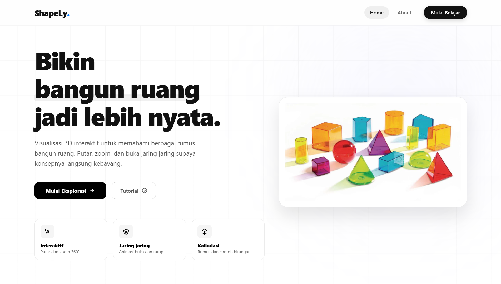
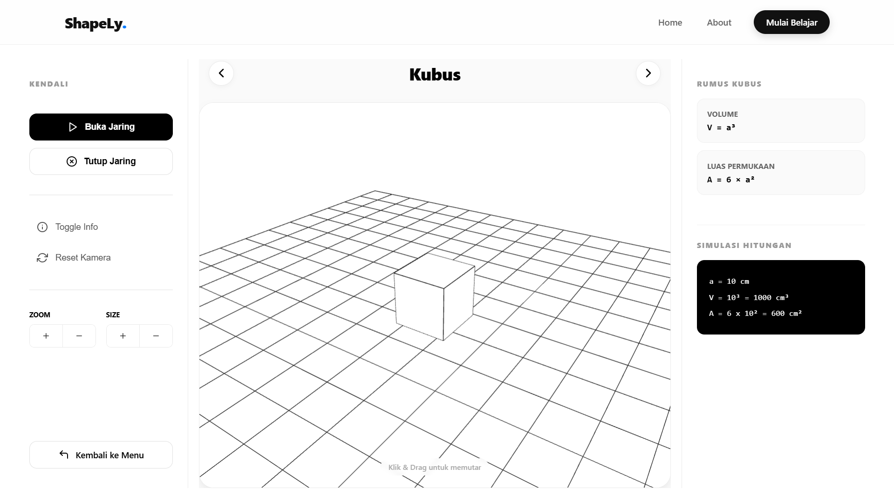

# ShapeLy | Interactive 3D Shapes Learning App

Web app edukasi untuk membantu memahami **visualisasi bangun ruang** secara lebih nyata melalui **3D viewer interaktif**, kontrol kamera, serta panel **rumus dan contoh perhitungan** agar konsep matematika pada tiap bangun ruang lebih mudah dipahami daripada hanya mengandalkan gambar 2D.

---

## Screenshots / Preview






---

## Live Demo
https://shapely-brm.vercel.app/

---

## ✨ Fitur Utama

### 3D Viewer Interaktif
- **Rotate & zoom** objek 3D (drag untuk rotate, scroll/controls untuk zoom)
- **Reset view** (balik ke sudut pandang awal)
- Kontrol aksi viewer via panel tombol (sesuai shape)

### Panel Rumus & Contoh
- Menampilkan **rumus** (luas/volume atau yang relevan) untuk setiap bangun ruang
- Menampilkan **contoh / simulasi nilai** (contoh input angka) yang bisa berubah mengikuti interaksi

### Navigasi Antar Shape
- Tombol **Prev/Next** untuk pindah shape tanpa balik ke list
- Halaman list shape untuk eksplor semua bangun yang tersedia

### UI & Responsiveness
- Layout halaman viewer: **kontrol + canvas 3D + panel rumus**
- Styling pakai **SCSS Modules** + token global untuk konsistensi

---

## 🧰 Tech Stack
- **React 19**
- **Vite**
- **React Router DOM**
- **Three.js** (render 3D)
- **Framer Motion** (animasi UI)
- **react-icons**
- **Sass / SCSS Modules**
- **ESLint**

---

## 📌 Shapes 
- Cube (Kubus)
- Cuboid (Balok)
- Cone (Kerucut)
- Cylinder (Tabung)
- Pyramid (Limas)

---

## 🧭 Routes
- `/` : Home
- `/shapes` : List / katalog bangun ruang
- `/shape/:key` : Viewer shape (contoh: `/shape/cube`)
- `/about` : About
- `/*` : Not Found

---

## 📁 Struktur Project

```txt
shapely/
|__ public/
|   |__ pavicon.png
|
|__ src/
|   |__ app/
|   |   |__ App.jsx
|   |   |__ router.jsx
|   |   |__ shapes.config.js
|   |
|   |__ assets/
|   |   |__ home/
|   |   |__ notfound/
|   |
|   |__ components/
|   |   |__ Footer/
|   |   |__ Navbar/
|   |
|   |__ hooks/
|   |   |__ useBodyScrollLock.js
|   |   |__ useHideOnScrollMotion.js
|   |   |__ useIsDesktop.js
|   |
|   |__ pages/
|   |   |__ About/
|   |   |   |__ About.jsx
|   |   |   |__ About.module.scss
|   |   |
|   |   |__ Home/
|   |   |   |__ Home.jsx
|   |   |   |__ Home.module.scss
|   |   |
|   |   |__ NotFound/
|   |   |   |__ NotFound.jsx
|   |   |   |__ NotFound.module.scss
|   |   |
|   |   |__ Shapes/
|   |   |   |__ Shapes.jsx
|   |   |   |__ Shapes.module.scss
|   |   |
|   |   |__ ShapeViewer/
|   |       |__ ShapeViewerPage.jsx
|   |       |__ ShapeViewerPage.module.scss
|   |       |__ ShapeViewerRoute.jsx
|   |
|   |__ shapes/
|   |   |__ cone/
|   |   |   |__ initCone.js
|   |   |__ cube/
|   |   |   |__ initCube.js
|   |   |__ cuboid/
|   |   |   |__ initCuboid.js
|   |   |__ cylinder/
|   |   |   |__ initCylinder.js
|   |   |__ pyramid/
|   |       |__ initPyramid.js
|   |
|   |__ styles/
|   |   |__ globals.scss
|   |   |__ tokens.scss
|   |
|   |__ main.jsx
|
|__ .gitignore
|__ eslint.config.js
|__ index.html
|__ package-lock.json
|__ package.json
|__ README.md
|__ vite.config.js
```

## Instalasi & Menjalankan Project
#### 1) Clone repository
```bash
git clone https://github.com/lynxrawrr/shapely.git
cd shapely
```

#### 2) Install dependencies dan jalankan development server
```bash
npm install
npm run dev
```